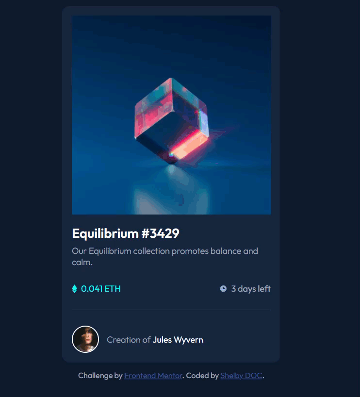

# Frontend Mentor - NFT preview card component solution

This is a solution to the [NFT preview card component challenge on Frontend Mentor](https://www.frontendmentor.io/challenges/nft-preview-card-component-SbdUL_w0U). Frontend Mentor challenges help you improve your coding skills by building realistic projects.

## Table of contents

- [Overview](#overview)
  - [The challenge](#the-challenge)
  - [Screenshot](#screenshot)
  - [Links](#links)
- [My process](#my-process)
  - [Built with](#built-with)
  - [What I learned](#what-i-learned)
  - [Continued development](#continued-development)
- [Author](#author)

## Overview

### The challenge

Users should be able to:

- View the optimal layout depending on their device's screen size
- See hover states for interactive elements

### Screenshot GIF



### Links

- Solution URL: [Add solution URL here](https://www.frontendmentor.io/solutions/nft-preview-card-component-sOR3cEHWf)
- Live Site URL: [https://shelb-doc.github.io/NFT-preview-card-component/](https://shelb-doc.github.io/NFT-preview-card-component/)

## My process

### Built with

- Semantic HTML5 markup
- CSS Grid
- Mobile-first workflow

### What I learned

I'm really proud of this snippet for the hover over on the image and getting the sizing right

```css
.container .main-image div{
    position: absolute;
    top: 0;
    background-color: hsl(178, 100%, 50%, 65%);
    width: 100%;
    height: calc(100% - 5px);
    z-index: 999;
    opacity: 0;
    transition: opacity 0.3s ease-in-out;
}
```
### Continued development

As a goal for becoming a Front End Developer, I want to dive deep into learning CSS and SASS for the next Challange.

## Author

- Website - [Shelby De Oliveira Cignetti](https://shelby-doc-portfolio.netlify.app/)
- Frontend Mentor - [@shelb-doc](https://www.frontendmentor.io/profile/shelb-doc)
- Twitter - [@reportturret](https://www.twitter.com/reportturret)